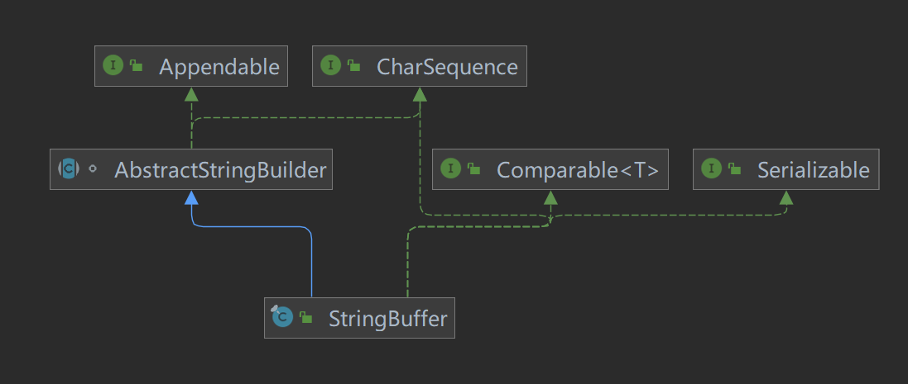

# String

String类是一个不可变类，在底层是由一个字符数组来储存的，且这个字符数组是final，既如果指向了一个地址就不能再改变了

由此引出了String的种种性质。

```java
String s1="abc";
String s2=new String("abc");
```

这两种创建方式是不一样的。

1. 直接赋值的情况，系统会先去查看常量池中有没有“abc“对象，如果有，那么s1会直接引用它。如果没有则在常量池中创建一个”abc“对象，这个”abc“一旦在常量池中创建就不会消失，可供多个字符串变量同时引用
2. 使用构造器的情况，每次new都会在堆中创建一个对象，这个对象维护了一个字符数组，这个数组再如同1中去常量池中引用“abc”。

判断字符串相等：判断字符串相等实际上就是在判断引用的地址是否相等。

```java
String a="123"+"456";
```

上面只创建了一个对象，编译器会进行优化：上面等价于String a=“123456”

字符串常量相加之间看最终生成了什么，池里就添加什么

```java
String a="123";
String b="456";
String c=a+b;
String d="123456"
System.out.println(c==d);    
```

上面的代码创建了三个对象。

运行过程：

在底层会创建一个StringBuilder类对象，然后把“123”和“456”分别append进去，最后再调用toString方法生成String引用给a。所以a先指向堆中的String对象，再指向常量池中的“123456”

c和d不是同一个对象，返回false


String的缺点：考察下面这样一段代码

```java
String s="";
for(int i=0,i<90000,i++){
    s+="abc"
}
```

由于String是一个final类，所以每次都需要在常量池中重新创建对象再重新指向。所以开销非常大

# StringBuffer类

StringBuffer代表可变的字符序列，可以对字符串序列进行增删。

很多方法和String相同但是，StringBuffer是可以改变长度的

StringBuffer是一个容器

下面是继承关系图



StringBuffer的直接父类是AbstractStringBuilder，实现了Serializable（可以串行化）

在父类中，有属性：char数组value，但**不是final类型的**。该value数组存放字符串内容。因此存放在堆中

StringBuffer是一个final类，不能被继承

- StringBuffer和String的对比：

  1. String类保存的是字符串常量，里面的值不能修改，每次String类的修改实际上就是更改地址，效率较低

     //private final char[] value;

  2. StringBuffer保存的是字符串变量，里面的值可以修改，每次StringBuffer的更新实际上就是更新内容，不用每次更新地址效率较高//char[] value//存放在堆中

     - 只有当数组的储存空间不够了才会更改地址，它有自己的一套扩容机制

```java
new StringBuffer();//size:16
new StringBuffer(int size);
new StringBuffer(String s);
```

第一个无参数的构造器默认的size为16

可以传进参数指定数组大小

 给定一个String创建一个StringBuffer，size为当前字符串的大小加上16，如下图所示


- StringBuffer的append方法既改变了自己，又返回了StringBuffer对象（自己--this）
- append方法如果接收到了null，会返回一个包含null的字符数组
- 如果null传给构造器会抛出空指针异常

# StringBuilder

这个类的前身是StringBuffer，这个两个类的API是一样的。

区别是StringBuffer支持多线程增加或删除字符（线程安全）

如果所有的字符串编辑都在单个线程中执行（通常都是这样），则应该使用StringBuilder


继承关系和StringBuffer一样。

# 三者的辨析

StringBuffer和StringBuilder非常相似，都代表可变字符序列，方法也yiy

String为不可变序列，效率低但是复用率高

StringBuffer有线程安全，但是增删的效率不如StringBuilder。

如果我们需要对字符串做大量的修改就不要使用String了


# 使用原则

如果字符串存在大量修改，一般使用StringBuilder和StringBuffer，单线程用StringBuilder，多线程用StringBuffer

如果字符串修改很少，被多个对象引用，使用String，比如配置信息等。
